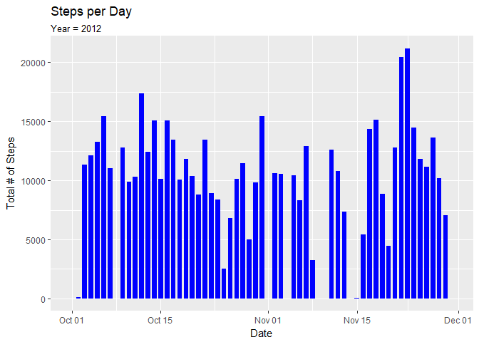
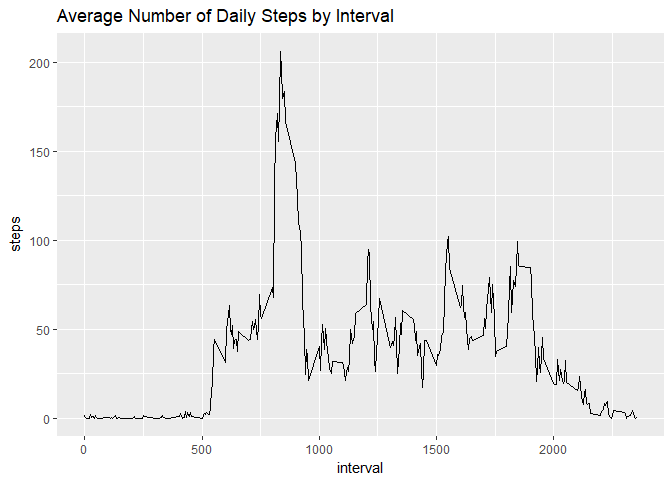
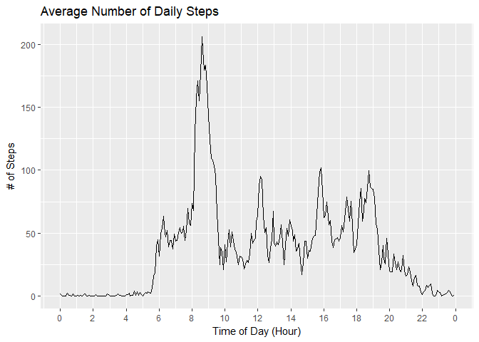
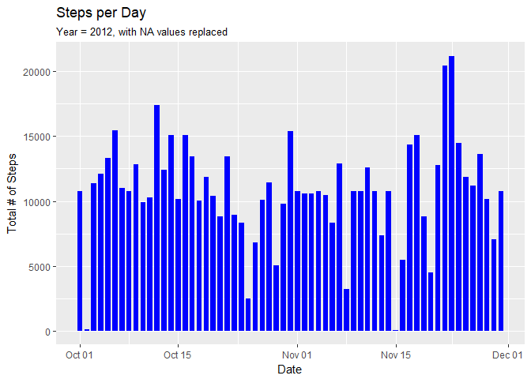
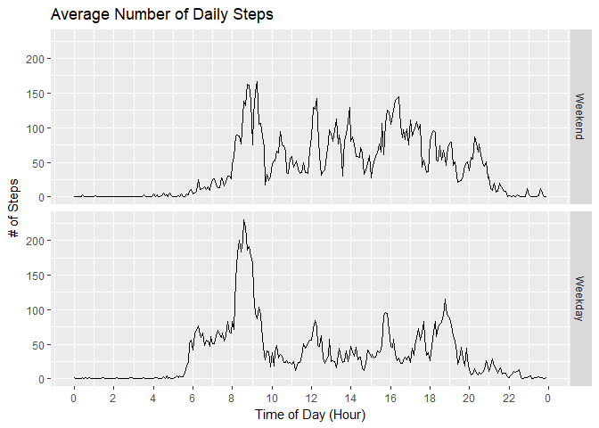

## Loading and preprocessing the data
Load the necessary libraries.

```r
library(ggplot2)
library(dplyr, warn.conflicts = FALSE)
library(lubridate, warn.conflicts = FALSE)
```

Load the data, take a quick look at it's structure, and convert the date strings
to POSIX dates.

```r
activity <- read.csv("activity.csv")
str(activity)
```

```
## 'data.frame':	17568 obs. of  3 variables:
##  $ steps   : int  NA NA NA NA NA NA NA NA NA NA ...
##  $ date    : Factor w/ 61 levels "2012-10-01","2012-10-02",..: 1 1 1 1 1 1 1 1 1 1 ...
##  $ interval: int  0 5 10 15 20 25 30 35 40 45 ...
```

```r
activity$date <- ymd(activity$date)
```


## What is mean total number of steps taken per day?
To calculate the total number of steps taken per day, use the `group_by()`
function to split the data by `date`, and then use the `summarize()` function
to calculate the total number of steps for each day.

The resulting data frame can be easily plotted using ggplot2 and the mean and
median of the total number of steps per day can be calculated using the `mean()`
and `median()` functions respectively.

```r
# Calculate total # of steps per day
perday.df <- activity %>% group_by(date) %>% summarize(steps = sum(steps, na.rm = TRUE))

# Plot total # of steps vs. date
g <- ggplot(perday.df, aes(x = date, y = steps))
g + geom_col(width = 0.75, fill = "blue") + 
    ggtitle("Steps per Day", subtitle = "Year = 2012") +
    ylab("Total # of Steps") + xlab("Date")
```

<!-- -->

```r
# Calculate mean and median of the total # of steps per day
mean.steps <- mean(perday.df$steps, na.rm = TRUE)
print(mean.steps)
```

```
## [1] 9354.23
```

```r
median.steps <- median(perday.df$steps, na.rm = TRUE)
print(median.steps)
```

```
## [1] 10395
```

The mean number of steps per day is 9354.
The median number of steps per day is 10395.

## What is the average daily activity pattern?
In order to calculate the average daily activity pattern, use the `group_by()`
function to split the data by `interval`, then use the `summarise()` function to
calculate the mean number of steps for each interval.  The resulting data frame
can be plotted with ggplot2.


```r
# Calculate mean number of steps per interval
daily.df <- activity %>% group_by(interval) %>% 
                         summarise(steps = mean(steps, na.rm = TRUE))

# Plot mean number of steps vs. interval
g.avg.daily <- ggplot(daily.df, aes(y = steps, x = interval))
g.avg.daily + geom_line() + ggtitle("Average Number of Daily Steps by Interval")
```

<!-- -->

This graph looks a bit jagged due to the fact that `interval` is not a 
continuous variable.  For example the three intervals on either side of 1am are
45, 50, 55, 100, 105, 110.  You can see there is a 45 unit jump in the `interval` 
value at each hour demarcation.

In order to make this graph look nicer and easier to interpret, the 
`interval` variable can be used to calculate time of day.

```r
# A function to convert interval values to time of day
interval2time <- function(x) {
    min <- x %% 100
    hr  <- floor(x / 100)
    hm(paste(hr, min, sep = ":"))
}

# Use interval to calculate time of day
daily.df$time <- interval2time(daily.df$interval)

# Plot average # of steps vs. time of day
g2.avg.daily <- ggplot(daily.df, aes(x = time, y = steps))
g2.avg.daily + geom_line() + 
               scale_x_time(breaks = seq(0, 24*60^2, 2*60^2), 
                            labels = function(x) hour(x)) +
               xlab("Time of Day (Hour)") + ylab("# of Steps") +
               ggtitle("Average Number of Daily Steps")
```

<!-- -->
               
The interval with the maximum number of step can be found using the `max()` function.

```r
max.index <- which(daily.df$steps == max(daily.df$steps))
daily.df[max.index, 1:3]
```

```
## # A tibble: 1 x 3
##   interval steps time        
##      <int> <dbl> <S4: Period>
## 1      835  206. 8H 35M 0S
```
From tha above we can see that the average maximum number of steps, 
206, occurs at interval 
835.  This correspondes to
08:35 AM.

## Imputing missing values

Calculate the total number and the proportion of NA values in the data.

```r
na.total <- sum(is.na(activity$steps))
print(na.total)
```

```
## [1] 2304
```

```r
na.proportion <- mean(is.na(activity$steps))
print(na.proportion)
```

```
## [1] 0.1311475
```
There are 2304 NA values in the data set, which 
accounts for 13.1% of all observations 
in the data set.

In order to replace these NA value, first create a function that takes a row 
from the `activity` data frame and  returns either the value of the `step` 
variable, or the mean value for that interval from the `daily.df` data frame if
the `step` variable is NA.

```r
# A function to output a valid step value for one row of the activity data frame
replace.na <- function(x, replace.df = daily.df) {
    if(is.na(x[1])) {
        interval <- as.numeric(x[3])
        replace.index <- which(replace.df$interval == interval)
        x[1] <- round(replace.df$steps[replace.index])
    }
    as.numeric(x[1])
}
```

Use the above function with the `apply()` function to create the `steps2` variable in the 
`activity` data frame.

```r
activity$steps2 <- apply(activity, 1, replace.na)
```

Now recalculate the mean, median, and total number of steps per day

```r
# Calculate total # of steps per day 
perday.df <- activity %>% group_by(date) %>% summarize(steps = sum(steps2, na.rm = TRUE))

# Plot total # of steps vs. date
g <- ggplot(perday.df, aes(x = date, y = steps))
g + geom_col(width = 0.75, fill = "blue") + 
    ggtitle("Steps per Day", subtitle = "Year = 2012, with NA values replaced") +
    ylab("Total # of Steps") + xlab("Date")
```

<!-- -->

```r
# Calculate mean and median of the total # of steps per day
mean.steps <- mean(perday.df$steps, na.rm = TRUE)
print(mean.steps)
```

```
## [1] 10765.64
```

```r
median.steps <- median(perday.df$steps, na.rm = TRUE)
print(median.steps)
```

```
## [1] 10762
```

Compared to the histogram of total number of steps taken per day before NA
values where replaced, the graph above shows no days with missing data.

The mean number of steps per day is 10766.
The median number of steps per day is 10762.
Both of these results represent increased values relative to the calculations
before replacing NA values.

## Are there differences in activity patterns between weekdays and weekends?
In order to answer this question, we need to determine what day of the week each
date in the data set represents.  This can be done with the `wday()` function from 
the `lubridate` package.

```r
# Use wday() to create a new weekday variable in the activity data frame
activity$weekday <- wday(activity$date)

# Create a factor variable called daytype with two levels: weekday & weekend
activity$daytype <- as.factor(activity$weekday %in% 2:6)
levels(activity$daytype) <- c("Weekend", "Weekday")

# For each daytype, calculate the mean steps per interval
daytype.df <- activity %>% group_by(daytype, interval) %>% summarise(mean_steps = mean(steps2))

# Calculate time of day from the interval variable
daytype.df$time <- interval2time(daytype.df$interval)

# Plot the mean steps per interval vs. time of day for weekday and 
# weekends using a facet_grid
g.daytype <- ggplot(daytype.df, aes(x = time, y = mean_steps))
g.daytype + geom_line() + 
            facet_grid(daytype ~ .) +
            scale_x_time(breaks = seq(0, 24*60^2, 2*60^2), 
                         labels = function(x) hour(x)) +
            xlab("Time of Day (Hour)") + ylab("# of Steps") +
            ggtitle("Average Number of Daily Steps")
```

<!-- -->

From the above graphs we can make the following conjectures regarding the 
individual this data was taken from:

1. The individual gets up at ~6:00AM on weekdays.
2. The individual gets up at ~8:00AM on weekends.
3. The individual does some physical activity between 8:00AM and 9:00Am on weekdays
4. On weekends, the individual is more active throughout the day, compared to weekdays.
5. On weekdays, the individual is more active in the morning (before 10AM), but less active in the afternoon, compared to weekends.
6. The individual goes to bed at ~10:00PM on weekdays.
7. The individual goes to bed at ~11:00PM on weekends.
